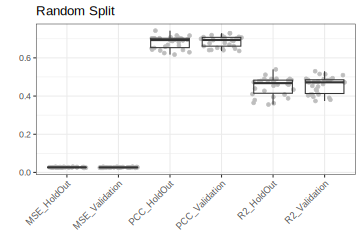
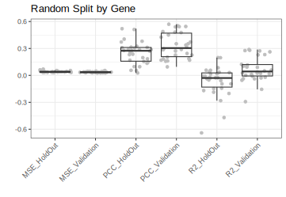

# GNN4siRNA-Predict  

This repository is a modified and improved version of the original **GNN4siRNA** model.  
- **Original Code**: [GitHub Repository](https://github.com/BCB4PM/GNN4siRNA)  
- **Original Paper**: [PubMed Central](https://pmc.ncbi.nlm.nih.gov/articles/PMC9696923/)  

## Installation & Requirements  

### Prerequisites  
- **ViennaRNA v2.7.0**  
- **Python 3.6** (with either Anaconda or Pyenv)  

### Installation  

Using **Conda**:  
```bash
conda create --name rnai python=3.6
conda activate rnai
```  

Using **Pyenv**:  
```bash
pyenv install 3.6.13
pyenv virtualenv 3.6.13 rnai
pyenv activate rnai
```  

After setting up the virtual environment, install the required dependencies:  
```bash
pip install -r requirements.txt
```  

## Model Creation & Prediction  

The original code lacked functionality for **creating the model** and **making predictions on new data**. Additionally, saving and reloading models using StellarGraph caused compatibility issues.  

### Enhancements in this Version:  
- **Model Creation & Prediction Combined**: Both are executed in a single run to avoid reloading issues.  
- **Model Optimization Integrated**: Optimizations are applied during model generation.  
  - Convergence is allowed and optimized with a custum reduce learning rate function that restores best weights on reduction.
- **ViennaRNA Execution**: The most computationally intensive step, but necessary for accurate results.  
  - Correct strand usage for Gibbs Free energy calculations.  The original paper used the incorrect sense siRNA strand for mRNA binding. See the bottom for the data showing the incorrect strand usage.

## Usage  

Run the following command within the virtual environment:  
```bash
python predict.py --sirna_fasta <siRNA_fasta_file> --mrna_fasta <mRNA_fasta_file> --sirna_mrna_csv <csv_file>
```  

### Input File Requirements  
The `<csv_file>` must contain two columns:  
- **siRNA**: Names of siRNA sequences, matching the FASTA file order.  
- **mRNA**: Corresponding mRNA target names from the mRNA FASTA file.  

### Output  
The script will generate predictions and save them as:  
```bash
<csv_file>.prediction.csv
```  

## Model Evaluation  

### Evaluation Methods Added  
This version includes an improved evaluation strategy that compares two data split approaches:  
1. **Split by Gene** (Prevents information leakage and improves generalizability).  
2. **Random Split** (As used in the original code and paper).  

Additionally, a **hold-out set evaluation** is performed using a **6-fold strategy**:  
- **1 Fold**: Hold-out set  
- **1 Fold**: Validation set  
- **4 Folds**: Training set  
- This results in **30 MSE, R², and PCC values** (6 hold-outs × 5-fold cross-validation).  

### Running Evaluations  

To evaluate the model **by gene split**:  
```bash
python predict.py --evaluate
```  

To evaluate the model **with random splitting**:  
```bash
python predict.py --evaluate --random_split
```  

### Evaluation Results  

#### Random Split Evaluation  
  

#### Gene-Based Split Evaluation  
  

#### Gibbs Fee Energy Evaluation

(A) X-axis represents Gibbs Free Energy recalculated for either the sense or the antisense siRNA, colored Red and Blue. Y-axis represents the Gibbs Free Energy given by the original authors.  There is a perfect correlation with the Sense strand siRNA calculations.
(B) Length of identified mRNA binding site for the given siRNA, either sense or antisense.  Antisense shows a median binding site of 21 nucleotides, the expected length, indicating that antisense strand should be used as input into RNAup Gibbs Free energy calculations.

#### Key Findings:  
- **Random Splitting (Validation R² ≈ 0.47)**: Matches the original paper’s results.  
- **Gene Splitting (Hold-out R² ≈ -0.058)**: Performance drops significantly when predicting on unseen genes.  

#### Interpretation:  
Since the model is based on a **graph architecture** where siRNA and mRNA are treated as **nodes** with interactions as **edges**, it struggles to generalize when encountering genes it hasn't seen before. **This suggests that the model is best suited for predicting efficacy when the target gene is present in the training dataset.**  

---  

This improved version ensures **better generalization, proper model evaluation, and the ability to make new predictions.** More improvements coming soon.  
